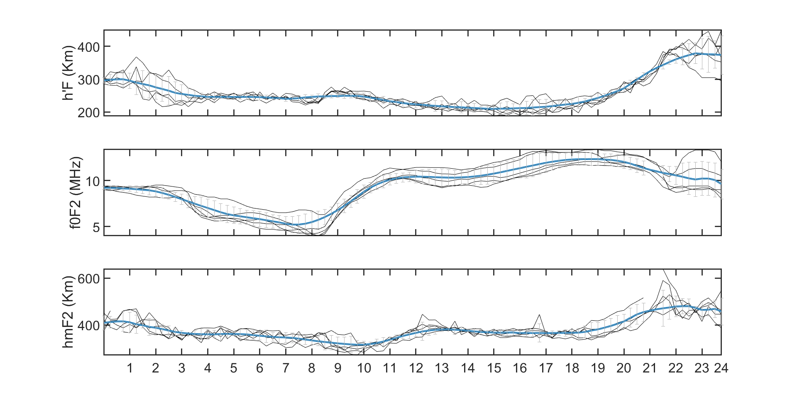

# 📊 Análise de Parâmetros Ionosféricos em Dias Geomagneticamente Calmos

**Aplicação MATLAB para estudo do comportamento ionosférico durante períodos de baixa atividade geomagnética**

Este projeto processa e visualiza dados de sondagem ionosférica dos 5 dias mais calmos do ponto de vista geomagnético. O script analisa três parâmetros fundamentais:

- **h'F**: Altura da camada F (km)
- **f0F2**: Frequência crítica da camada F2 (MHz)
- **hmF2**: Altura do pico da camada F2 (km)

## 🚀 Tecnologias Usadas

- **MATLAB**
- **Gráficos e Visualização de Dados**

## 🔍 Características Principais

- Processamento automático de arquivos de dados ionosféricos
- Visualização comparativa dos 5 dias selecionados
- Cálculo de médias móveis e desvios padrão
- Gráficos temporais com resolução de 15 minutos
- Análise do comportamento diurno em condições geomagnéticas estáveis

## 📈 Metodologia

1. **Seleção de dados**: Focada nos dias com menor atividade geomagnética
2. **Processamento**:
   - Importação dos arquivos TXT
   - Extração dos parâmetros h'F, f0F2 e hmF2
   - Cálculo de estatísticas (média e desvio padrão)
3. **Visualização**:
   - Superposição das curvas dos 5 dias
   - Linha de média móvel (janela de 12 pontos)
   - Faixa de desvio padrão

## 🛠️ Como Utilizar

1. Coloque os arquivos no formato `DIAS_CALMOS_YYYYMMDD(DDD).TXT` na pasta do projeto
2. Execute o script no MATLAB
3. Visualize os gráficos gerados automaticamente:
   - Cada subplot mostra um parâmetro diferente
   - Eixo X representa o horário universal (0-24h)
   - Eixo Y mostra os valores do parâmetro

## 📜 Licença

Este projeto está licenciado sob a Licença MIT - veja o arquivo LICENSE para mais detalhes.

  

